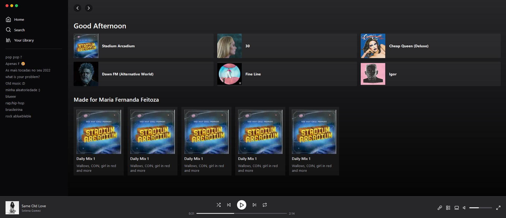

<div align='center'>
  <h1 >Tailwind Spotify</h1>
</div>

<br />

<div align='center'>

  
</div>

<br />

 <h4>
Este é um projeto que replica a página inicial do Spotify usando Tailwind CSS.
</h4>

## Tecnologias utilizadas

- [Tailwind CSS](https://tailwindcss.com/)
- [HTML](https://html.com/)
- [CSS](https://css.com/)
- [NEXT](https://next.com/)

## Instalação

1. Clone este repositório executando o seguinte comando no terminal:

   ```
   git clone https://github.com/Mornieur/tailwind-spotify.git
   
   ```

    Navegue até a pasta do projeto:
    
    ```
    
    cd tailwind-spotify

    ```
  

Caso queira realizar modificações no projeto, você pode seguir os seguintes passos:

 Execute o comando abaixo no terminal para instalar todas as dependências necessárias para o projeto funcionar corretamente:
 
 ```

npm install

 ```

Após realizar as modificações desejadas, execute o seguinte comando no terminal para compilar o CSS do Tailwind:

```
npm run build

```

Esse comando irá gerar um arquivo style.css na pasta dist com o CSS compilado.
        

## Contribuindo

Contribuições são sempre bem-vindas! Sinta-se à vontade para abrir uma issue ou uma pull request para melhorar este projeto.
Licença

Este projeto é distribuído sob a licença MIT. Consulte o arquivo LICENSE para obter mais informações.

Espero que isso ajude!
